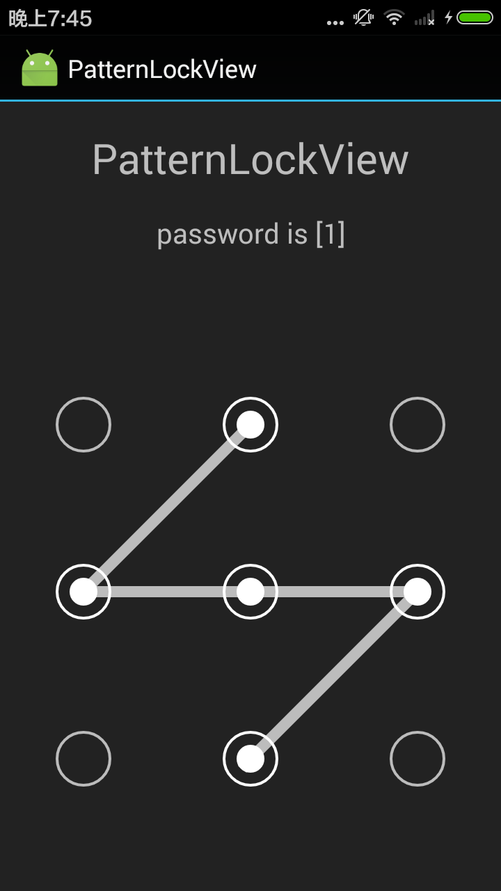

# PatternLockView
A Simple Pattern Lock View for Android

# Features:
* support n * n Pattern
* two layout mode supported: Identical-Area mode & SpacingPadding mode.
* support viborate
* Support `API LEVEL >= 8`

[Download Demo APK](https://github.com/xyxyLiu/PatternLockView/releases/download/1.0/app-debug.apk)

# ScreenShot



# How to use
```xml
<com.reginald.patternlockview.PatternLockView
        android:id="@+id/lock_view"
        android:layout_width="match_parent"
        android:layout_height="wrap_content"
        android:layout_gravity="center"
        app:lock_size="3"
        app:lock_enableVibrate="true"
        app:lock_vibrateTime="100"
        app:lock_lineColor="#b2ffffff"
        app:lock_lineWidth="8dp"
        app:lock_nodeSize="10dp"
        app:lock_spacing="90dp"
        app:lock_padding="20dp"
        app:lock_nodeTouchExpand="15dp"
        app:lock_nodeSrc="@drawable/pattern_lock_dot_node_normal"
        app:lock_nodeHighlightSrc="@drawable/pattern_lock_dot_node_highlighted"
        app:lock_nodeOnAnim="@anim/pattern_lock_node_anim_larger"
        app:lock_autoLink="false"
        />
```
properties:
* lock_size: the size of the n * n lock view.  (Optional, default is 3)
* lock_enableVibrate: enable vibration when one node is linked (Optional, default is false)
* lock_vibrateTime: time the vibration lasting (Optional, default is 20ms)
* lock_lineWidth: the width of the link line between nodes (Required)
* lock_lineColor: the color of the link line between nodes (Required)
* lock_nodeSize: the size of the node (Required)
* lock_spacing: the spacing between adjacent nodes (Optional, if given, SpacingPadding Mode is applied, otherwise, Identical-Area Mode is applied)
* lock_padding: the padding of the lockview (Optional, default is 0)
* lock_nodeTouchExpand: the expanded area of the node which receive touch action. (Optional, default is 0)
* lock_nodeSrc: the resource id the node when it's in normal state, e.g. node is unlinked. (Required)
* lock_nodeHighlightSrc: the resource id the node when it's in highlighted state, e.g. node is linked. (Optional)
* lock_nodeCorrectSrc: the resource id the node when it's in correct state, e.g. password correct. (Optional)
* lock_nodeErrorSrc: the resource id the node when it's in error state, e.g. password error. (Optional)
* lock_autolink: whether to automatic link the nodes in the path of two selected nodes. (Optional, default is false)
#

# Layout Mode:
* **SpacingPadding Mode:**
If lock_spacing is given, PatternLockView use lock_nodeSize, lock_spacing and lock_padding to layout the view as the figure below shows.
<div></div>

* **Identical-Area Mode:**
If lock_spacing is NOT given, PatternLockView only use nodeSize to layout the view(lock_spacing and lock_padding are ignored). It will devided the whole area into n * n identical area, and layout the node in center as the figure below shows.
<div></div>

# Handle Callbacks
* **Handle password result:** 
handle password result when user complete password input
```java
mLockView.setCallBack(new PatternLockView.CallBack() {
            @Override
            public int onFinish(PatternLockView.Password password) {
                Log.d(TAG, "password is " + password.string);
                if (password.string.equals(myPassWord)) {
                    // password is correct
                    return PatternLockView.CODE_PASSWORD_CORRECT;
                } else {
                    // password is error
                    return PatternLockView.CODE_PASSWORD_ERROR;
                }
            }
        });
```

* **Handle Node Touched Event:** 
handle the callback when one node is selected by the user
```java
mLockView.setOnNodeTouchListener(new PatternLockView.OnNodeTouchListener() {
            @Override
            public void onNodeTouched(int NodeId) {
                Log.d(TAG, "node " + NodeId + " is touched!");
            }
        });
```
