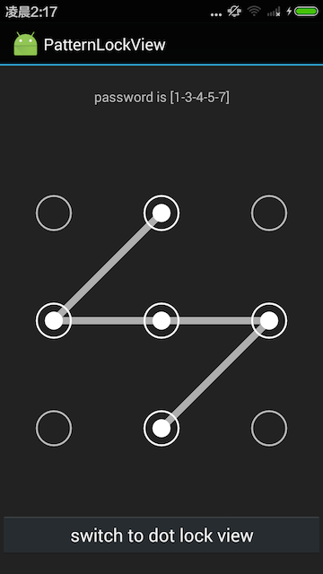
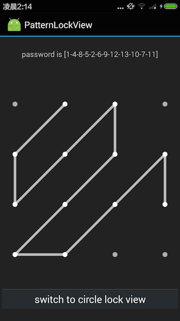

# PatternLockView
A Light-weight Pattern Lock View for Android

## Features:
* light weight and easy to use
* support n * n Pattern
* two layout mode supported: Identical-Area mode & SpacingPadding mode.
* support pattern invisible
* support vibrate
* support auto link between two nodes
* support password replay (added in v2.0.0)
* support `API LEVEL >= 8`

[Download Demo APK](https://github.com/xyxyLiu/PatternLockView/releases/download/2.0/PatternLockView-Demo-2.0.apk)

## ScreenShot



## Gradle Dependency
```groovy
repositories {
    ...
    jcenter()
}

dependencies {
    compile 'com.reginald:patternlock:2.0.0'
}
````
#### Change log
###### v2.0.0
- add password replay feature
- fix autolink bugs 

###### v1.1.0
- fix bug #1 
- added lock_lineCorrectColor and lock_lineErrorColor attributes

###### v1.0.0
- initial release

## How to use
```xml
<com.reginald.patternlockview.PatternLockView
        android:id="@+id/lock_view"
        android:layout_width="match_parent"
        android:layout_height="wrap_content"
        android:layout_gravity="center"
        app:lock_size="3"
        app:lock_enableVibrate="true"
        app:lock_vibrateTime="100"
        app:lock_lineColor="#b2ffffff"
        app:lock_lineWidth="5dp"
        app:lock_nodeSize="10dp"
        app:lock_spacing="90dp"
        app:lock_padding="20dp"
        app:lock_nodeTouchExpand="15dp"
        app:lock_nodeSrc="@drawable/pattern_lock_dot_node_normal"
        app:lock_nodeHighlightSrc="@drawable/pattern_lock_dot_node_highlighted"
        app:lock_nodeOnAnim="@anim/pattern_lock_node_anim_larger"
        app:lock_autoLink="false"
        />
```
properties:

|     attr    	|  required/optional(default value)  	|                         meaning                         	|
|:-----------:	|:---------:	|:----------------------------------------------------:	|
|  lock_nodeSize  	|   required    | the size of the node  	|
|  lock_nodeSrc  	| required       | the resource id of the node 	|
|  lock_spacing  	| if given, SpacingPadding Mode is applied,otherwise, Identical-Area Mode is applied       | the spacing between adjacent nodes 	|
|   lock_size   	|     optional, default is 3     	|         n, where it's an n * n lock view.        	|
| lock_enableVibrate 	| optional, default is false 	|          enable vibration when a node is linked          	|
| lock_vibrateTime      | optional, default is 20ms 	|          time the vibration lasting                     	|
|   lock_lineWidth 	|     optional, default is 5dp     	|         the width of the link line        	|
|   lock_lineColor  	|     optional, default is #FFFFFF     	|         the color of the link line         	|
|   lock_lineCorrectColor  	|     optional, default is lock_lineColor     	|         the color of the link line when the password is correct        	|
|   lock_lineErrorColor  	|     optional, default is lock_lineColor     	|         the color of the link line when the password is error             |
|  lock_padding  	| optional, default is 0       | the padding of the lockview 	|
|  lock_nodeTouchExpand  	| optional, default is 0       | the expanded area of the node which receive touch action. 	|
|  lock_nodeHighlightSrc  	| optional, default is null       | the resource id of the node when it's in highlighted state, e.g. node is linked. 	|
|  lock_nodeCorrectSrc  	| optional, default is null       | the resource id of the node when it's in correct state, e.g. password correct. 	|
|  lock_nodeErrorSrc  	| optional, default is null       | the resource id of the node when it's in error state, e.g. password error. 	|
|  lock_nodeOnAnim  	| optional, default is null       | the animation played when the node is linked. 	|
|  lock_autolink  	| optional, default is false       | whether to automatic link the nodes in the path of two linked nodes. 	|

## Layout Mode:
* **SpacingPadding Mode:**
If lock_spacing is given, PatternLockView use lock_nodeSize, lock_spacing and lock_padding to layout the view as the figure below shows.
<div></div>

* **Identical-Area Mode:**
If lock_spacing is NOT given, PatternLockView only use nodeSize to layout the view(lock_spacing and lock_padding are ignored). It will divided the whole area into n * n identical cells, and layout the node in the center of each cell as the figure below shows.
<div></div>

## Handle Callbacks
* **Handle password result:**
handle password result when user complete password input
```java
mLockView.setCallBack(new PatternLockView.CallBack() {
            @Override
            public int onFinish(PatternLockView.Password password) {
                Log.d(TAG, "password is " + password.string);
                if (password.string.equals(myPassWord)) {
                    // password is correct
                    return PatternLockView.CODE_PASSWORD_CORRECT;
                } else {
                    // password is error
                    return PatternLockView.CODE_PASSWORD_ERROR;
                }
            }
        });
```

* **Handle Node Touched Event:**
handle the callback when one node is selected by the user
```java
mLockView.setOnNodeTouchListener(new PatternLockView.OnNodeTouchListener() {
            @Override
            public void onNodeTouched(int NodeId) {
                Log.d(TAG, "node " + NodeId + " is touched!");
            }
        });
```

## Password Replay
```java
    // show password pattern
    mLockView.showPassword(myPassword);
    
    // show password pattern with animation
    mLockView.showPasswordWithAnim(myPassword);
```

## License

    Copyright 2016 xyxyLiu

    Licensed under the Apache License, Version 2.0 (the "License");
    you may not use this file except in compliance with the License.
    You may obtain a copy of the License at

       http://www.apache.org/licenses/LICENSE-2.0

    Unless required by applicable law or agreed to in writing, software
    distributed under the License is distributed on an "AS IS" BASIS,
    WITHOUT WARRANTIES OR CONDITIONS OF ANY KIND, either express or implied.
    See the License for the specific language governing permissions and
    limitations under the License.
